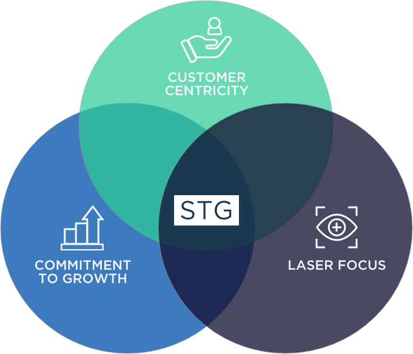

## pitch material

  

- customer

Wedding Management
- surveys on the top 10
- big industry numbers showing how huge it is in india // but no one's working on it
- 2 industries where people in india spend money, education and money.

Instagram - people prefer to just open links for fast searches
there's is a friction, so we figured we can use a platform they are already comfortable with like instagram / any suocial media.

- webviews and how they save information on browsers, so while it is counter intuitive, it is actually the most frictionless experience we've seen so far.
- the user just wants to use / tech stack is irrelevant.

let's have 2 subdivision on the pitches
- experience
- the dev's technicaly reasons for doing so.

BMC - 
USP - 

indians only ever wedding once in their own lives, so it becomes expensive because frequency of sales volume + status

stress involved in wedding planning like a whole month of hackathons.

budget range - presets but for wedding
premium deluxed / 

concierge services
you get a person on call?

no idea how many people show up, venue booking according to the size of the crowd.

[zola // wedding management in country](https://www.zola.com/)
[cvent](https://www.cvent.com/in)
[shaadi // tongue / religion / community](https://www.shaadi.com/)

# WellWed

hand humanitarian organization logos
velvet

colors
- haldi
- green / mehendi
- white

### FRONT END
- react
- tailwind
- antdesign
- sass / scss (css variables)
- color scheme lmao.

### design ideas
[tailwind movie shapes + blur](https://www.youtube.com/watch?v=Tmkr2kKUEgU)